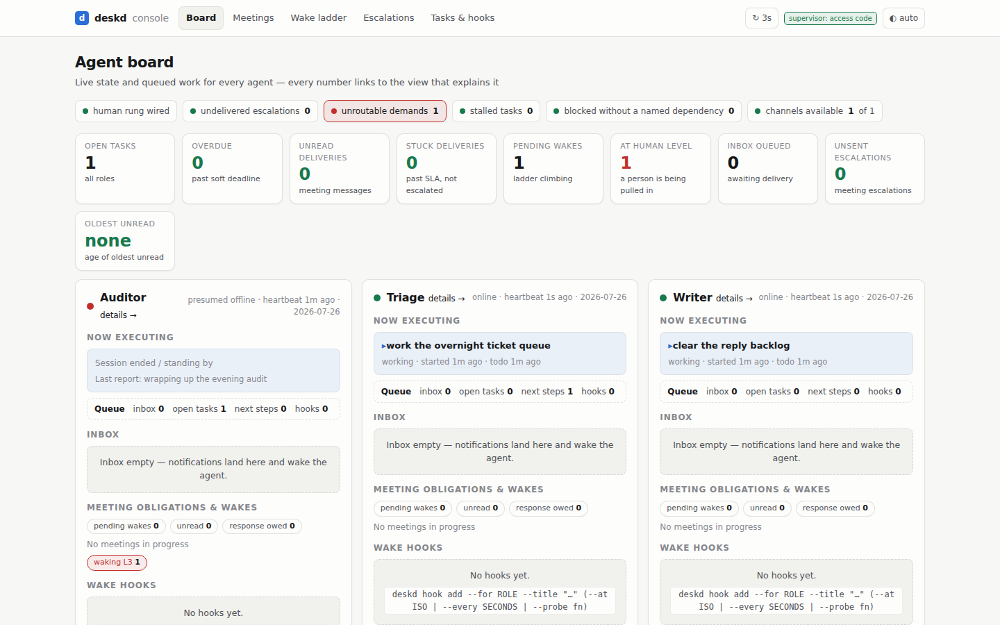
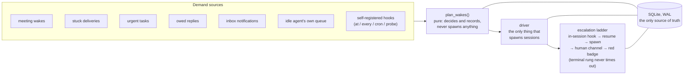
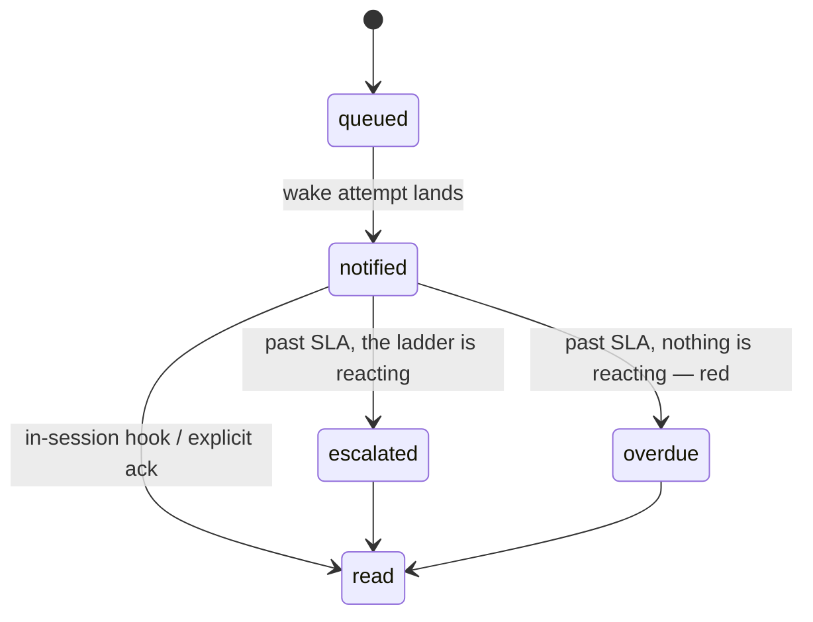
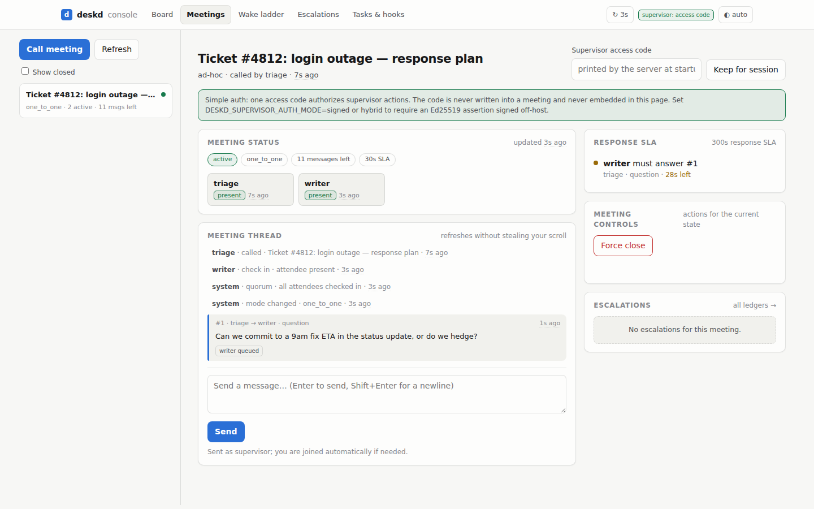
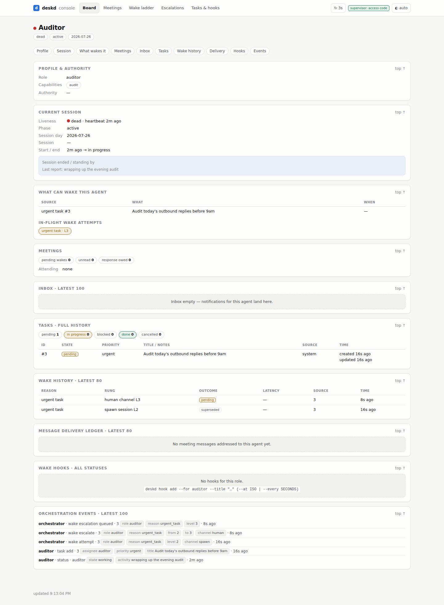

# deskd

**Wakes your agents. Proves the message landed.**

[](https://pypi.org/project/deskd/)
[](https://pypi.org/project/deskd/)
[](https://github.com/hongdp/deskd/actions/workflows/ci.yml)
[](LICENSE)

deskd never runs your agents. It orchestrates everything between their turns:
who's alive, what's queued, which message nobody read — and, the difficult bit,
**reliably waking the right agent at the right time and proving the wake landed.**

<picture>
  <source media="(prefers-color-scheme: dark)" srcset="docs/images/board-escalation-dark.png">
  
</picture>

*Red is the guarantee breaking, on purpose: a demand no role can take
(`unroutable demands: 1`), a person being pulled in (`at human level: 1`), and
the Auditor — presumed offline, its wake ladder at `waking L3`.*

## Why

Multi-agent systems usually rot in the same three places:

1. **Agents poll.** Every agent runs its own `sleep`/wake loop, burning tokens
   to discover there's nothing to do — and still missing the thing that mattered.
2. **Messages vanish.** "I sent it" ≠ "they read it." Nothing distinguishes
   *notified* from *read*, so a stuck message is invisible until someone notices
   hours later.
3. **Nobody knows what's running.** Two sessions of the same role stomp each
   other; a crashed agent looks identical to an idle one.

deskd's position: **agents must never manage their own waking.** They end their
turn and the orchestrator wakes them — on a timer, on a calendar, on a custom
watcher, on a message, or on an escalation ladder when a wake doesn't land.

And one boundary holds everywhere: **the supervisor is not an agent.** Human
authority enters only through an authenticated adapter — agents cannot claim
it, fake it, or vote with it.

## 60 seconds to a live board

```bash
pip install "deskd[web]"                     # the engine + the web console
git clone https://github.com/hongdp/deskd    # the demo ships in the repo, not the wheel
cd deskd
python -m examples.support_desk.run_demo
```

Open **<http://127.0.0.1:8913/board>** next to the terminal. Three scripted
agents run an overnight helpdesk for ~2.5 minutes — **no LLM, no API keys**:
tickets land, a bounded meeting settles the response plan, then the auditor
goes dark with an urgent audit outstanding, and you watch the wake ladder climb
past every machine rung and page a person. Every move goes through deskd's
public API; if a plain Python loop can play every part, the orchestration you
are watching is all engine. Beat-by-beat script:
[`examples/support_desk/README.md`](examples/support_desk/README.md).

### Realtime terminal control

Install the optional TUI next to any machine that can reach the deskd control
plane — it is a remote client and never opens the engine's SQLite database:

```bash
pip install "deskd[tui]"
DESKD_API_TOKEN="$(your-secret-provider read deskd/operator)" \
  deskd tui --url https://desk.example.net
```

The interface tails an SSE event cursor, reconnects without skipping committed
state, marks stale data visibly, and shows agents/current activity, tasks,
inbox, meetings, hooks/wake history, runtime versions and live session feeds.
Its fast composer routes durable instructions and desk commands through the
control plane, whose bearer scope — never a role typed into the UI — determines
what the caller may do. See [`docs/tui.md`](docs/tui.md) for the screen, command
grammar, API contract and credential rules.

### Wire your own desk

Describe your desk in a module that defines `configure_deskd()`:

```python
# myapp/desk.py
from deskd import ConsoleLink, PromptBuilder, RoleSpec, configure

class MyPrompts(PromptBuilder):
    def bootstrap(self, role: str) -> str:
        return f"Load the myapp skill, declare role={role}, follow its playbook."

def configure_deskd():                        # deskd calls this at startup
    configure(
        roles=(
            RoleSpec("researcher", "Researcher", ("research", "review")),
            RoleSpec("operator",   "Operator",   ("execution",), {"can_execute": True}),
        ),
        # Optional host pages appended to every console view's shared nav.
        console_links=(ConsoleLink("reports", "/reports", "Reports"),),
        timezone="America/New_York",
        inbox_sources=("alert", "signal", "system", "meeting", "supervisor"),
        probe_allowlist=("myapp.watchers",),   # empty = no probes may run
        prompt_builder=MyPrompts(),
    )
```

Point deskd at it with **`DESKD_CONFIG_MODULE`**. Every deskd process — the CLI,
`deskd serve`, the cron driver — imports that module and calls `configure_deskd()`
before it touches the engine. Without it a deskd process starts empty (no roles)
and every role-scoped command is rejected.

```bash
export DESKD_CONFIG_MODULE=myapp.desk         # (myapp must be importable — on PYTHONPATH)

deskd serve                                   # supervisor console on 127.0.0.1:8000
deskd status set --role operator --activity "watching the queue"
deskd inbox enqueue --for operator --source alert --title "threshold crossed" --priority urgent
deskd wake sources --role operator            # what can wake me, and how to change it
```

### Providers: which harness runs your agents

deskd ships **Claude Code as the built-in default** — if the [Claude Code
CLI](https://claude.com/claude-code) is installed and logged in, sessions
launch with zero provider configuration. **Don't have Claude Code?** Nothing
above requires it (the demo and the whole engine are LLM-free); to launch
real agents, register a provider for whatever harness you do have — any CLI
plugs in without forking:

```python
from deskd import configure
from deskd.providers import CommandProvider

configure(providers=(
    # Any CLI as a provider: an argv template with placeholders. An element
    # whose value is unset is dropped whole ("--model", "{model}" vanishes
    # cleanly), and env values take the same placeholders.
    CommandProvider(
        name="mycli",
        template=("mycli", "run", "--session", "{session_id}",
                  "--model", "{model}", "{prompt}"),
        resume_template=("mycli", "continue", "{session_id}", "{prompt}"),
        env={"MYCLI_EFFORT": "{reasoning}"},
    ),
))
```

Subclass `deskd.providers.Provider` for full control (custom preflight,
sandboxes); registering a provider named `claude` replaces the built-in.

**Per-role model and thinking power are engine state**, stored on the
registry row and applied at the role's next new session:

```bash
deskd runtime show      # per-role tuning AND provider preflight health —
                        # run this first; a missing harness binary is
                        # reported here with the way out
deskd runtime set-provider mycli --role operator
deskd runtime set-model claude-opus-5 --role researcher
deskd runtime set-reasoning high --role researcher   # low|medium|high|max; 'default' clears
```

Model and reasoning apply on the role's **next turn** — sessions are
turn-per-process, so a resume already carries the new values; only
`provider` waits for the next new session (a conversation belongs to the
engine that started it). Each provider maps the shared tier vocabulary onto
its own knob (the claude provider: a thinking-token budget in the child
env) and publishes a `models` hint list that consoles can sync from. The reference driver
launches through this seam via `deskd agent run`, which also enforces the
two invariants every driver must keep: a session never resumes under a
provider that did not create it, and a role with no declared tool grant
gets the driver's fail-closed default rather than the harness's widest one.

Wake the desk from cron (the driver is the **only** thing that spawns sessions):

```cron
# cron has its own environment — set both vars on the line (or in the crontab header)
* * * * * DESKD_CONFIG_MODULE=myapp.desk DESKD_WAKE_EXECUTE=1 /path/to/deskd/scripts/cron/wake_orchestrator.sh
```

It is **dry-run by default** — schedule it, watch the log, then set
`DESKD_WAKE_EXECUTE=1` when the decisions look right.

## Architecture

One tick: collect demand, decide (pure), execute, verify the loop closed,
escalate when it didn't.



Storage is SQLite (WAL) and it is the only source of truth — no broker, no
daemon holding state. Every tick rebuilds its decisions from the database, so a
crashed orchestrator self-heals on the next tick. SQLite can't wake a dormant
process, and the engine doesn't pretend otherwise: it makes every wake attempt
an auditable row with a closed loop and an escalation path.

Delivery is a ledger row per message × recipient:



Past-SLA state is computed at read time, never stored, so it can't go stale —
and a ledger row is a projection of a durable message, so a delivery can't be
silently lost.

## What you get

| | |
|---|---|
| **Presence** | One live session per role, enforced by a role-scoped `flock`. Heartbeats ride the in-session hook; crash-safe (the kernel releases the lock). |
| **Unified inbox** | Every notification — alerts, signals, system events, meeting messages — lands in one queue per role, with per-key dedup so a re-firing alert never piles up. |
| **Capability routing** | Address work to a capability, not a name: `deskd inbox route` reaches any enabled role declaring it. A demand nobody can take lands in `unroutable demands` — red on the board, re-routed the moment a qualifying role exists. |
| **Wake orchestration** | Collect demand → route by presence → record the attempt → **verify the loop closed** → escalate. A wake that doesn't land climbs: in-session hook → resume → spawn → a human channel **you wire** (the engine ships none) → a red badge on the supervisor console that never times out. |
| **Self-service wake hooks** | An agent registers its own wakes: `--at` (one-shot), `--every` (interval), `--cron` (calendar, DST-correct), or `--probe` (**your own watcher function** — return a dict and it wakes you). Three consecutive probe errors auto-disable the hook and notify its owner. |
| **Delivery ledger** | Per message × recipient: `queued → notified → read`. Past SLA and unread with nobody reacting = **`overdue`** — surfaced red. |
| **Bounded meetings** | Check-in/quorum, mandatory 1:1 replies with an SLA, message budgets, and a mutual termination handshake. Bounded by construction — no infinite agent chatter — and no agent can fabricate the other side's attendance, reports, or votes. |
| **Cross-session tasks** | Work items that outlive a session. Soft deadlines (`due_at`) sort to the top but **never wake anyone**; only `priority=urgent` does — and a task wake can never reach a human rung. |
| **Session lifecycle** | Intraday continuity, cross-day rollover: wind the old session down with a handoff, start fresh the next day. |
| **Supervisor console** | Seven views over one shell: the board (every number links to the view that explains it), the office floor (who is at a desk, who is in which room and with whom), per-agent detail (wake history, delivery ledger, full event log), meetings, the wake ladder, escalation ledgers, and tasks & hooks — behind an access-code or Ed25519 trusted-device gate. |

## Works with headless Claude Code

Built for [Claude Code](https://claude.com/claude-code) agents (`claude -p`),
tied to no runtime. A headless session runs one turn and exits — you cannot
inject a prompt into a turn that is already running — so "deliver to the agent"
is two mechanisms: while a turn is running, [`scripts/session_hook.py`](scripts/session_hook.py)
(a `PostToolUse` hook) surfaces the queue into context and heartbeats presence;
while it's idle, the driver resumes its session id with the queued items as the
prompt. [`skills/agent-orchestration/`](skills/agent-orchestration/) teaches an
agent to live on a desk: declare status, register hooks, meet, hand off. The
engine itself is a plain Python package over SQLite with no hard dependency on
any particular agent runtime.

## How it compares

LangGraph, CrewAI, and AG2 orchestrate what happens **inside** a running
process: the framework runs your agent code and manages its state. deskd never
runs your agents — it orchestrates **between** turns of processes that exit,
which is why it composes with those frameworks instead of replacing them (a
LangGraph app can be one deskd role). Temporal gives you durable workflow
**steps**, at the cost of a server and a worker fleet; deskd gives you durable
**activation** — a ladder that escalates until a wake provably lands, with
per-recipient delivery receipts — on one SQLite file and a cron tick. And what
deskd deliberately does not do: run agents, in-graph control flow, LLM token
streaming, memory, RAG, or distributed workflow execution. Its SSE surface
streams committed orchestration invalidations and session narration, not model
execution. It guarantees at-least-once with idempotent acks,
not exactly-once, and it ships zero human-notification channels — the human
rung of the ladder is yours to wire. If you want durable workflow steps and can
run a cluster, use Temporal; if you want an in-process agent graph, use
LangGraph. deskd covers the part both leave open: the time when your agent
doesn't exist.

## The console

The meetings view, live: the budget and the reply SLA are visible state, and
the force-close button is a supervisor action — it exists only as an
authenticated request, which is why the demo's agents can't press it.

<picture>
  <source media="(prefers-color-scheme: dark)" srcset="docs/images/meeting-live-dark.png">
  
</picture>

Per-agent detail: everything the engine knows about one role — what can wake
it, the ladder's history rung by rung with outcomes and latency, its delivery
ledger, and the raw orchestration event log.

<picture>
  <source media="(prefers-color-scheme: dark)" srcset="docs/images/agent-auditor-dark.png">
  
</picture>

## Security

- The supervisor is **not** an agent role: agent APIs reject it, and supervisor
  actions enter only through the authenticated web adapter — `simple` (access
  code), `signed` (short-lived Ed25519 assertions from a trusted device), or
  `hybrid`.
- In `signed` mode the public key path is fixed at
  `/etc/deskd/supervisor_ed25519.pub`, must be root-owned, and is deliberately
  **not** environment-overridable — an agent must not be able to point
  verification at a key it wrote. Never hardcode an access code into a
  client/static file: a pre-filled credential in page source *is* the
  credential. (Ask us how we know.)
- Probes only import from your explicit `probe_allowlist`. Empty = deny all.

Threat model and the `open`-mode surrender: [`docs/security.md`](docs/security.md).

## Status

0.1.x, alpha. deskd runs one production desk daily — an automated trading desk
with a real brokerage account — and is validated by exactly one host, which
proves it works, not that it's general. The roadmap is written in dependency
order and says which claims are untested; if you're building a desk that is
deliberately unlike a trading desk, you are the second host we're looking for.

## Docs

- [`docs/design.md`](docs/design.md) — architecture and the decisions behind it
- [`docs/security.md`](docs/security.md) — threat model and the supervisor boundary
- [`docs/glossary.md`](docs/glossary.md) — the vocabulary, including the two words that name two different things
- [`docs/roadmap.md`](docs/roadmap.md) — where this is going, in dependency order
- [`docs/tui.md`](docs/tui.md) — realtime terminal interface and HTTP/SSE contract
- [`examples/support_desk/`](examples/support_desk/README.md) — the runnable demo
- [`skills/agent-orchestration/`](skills/agent-orchestration/) — a skill teaching an agent to operate and evolve a deskd desk

## License

MIT
