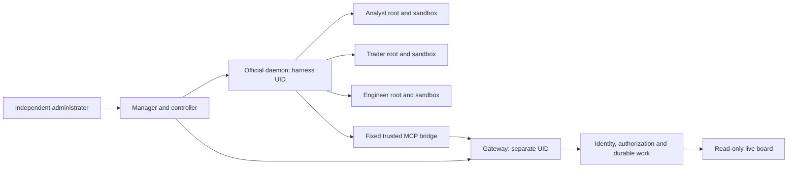

# Persistent multi-seat workspace

A workspace keeps a separate persistent root for each seat, routes durable work
between seats, and requires independent authority for shared effects. The new
entry point is `python -m deskd.workspace`; the existing `deskd` commands and
legacy databases are unchanged.

The installation uses an unmodified, pinned official Codex daemon, two non-root
service UIDs, a separate root management domain and role sandboxes. `install`
selects the fixed OpenAI API provider and requires an explicit model; an
administrator separately provisions its private gateway key file. `install-mock`
selects a local Responses mock for credential-free acceptance. Neither command
imports a user's login or enables a broker. Real API connectivity, billing and
external-effect adapters are outside the mock validation.



## Try the complete local rehearsal

Run from a checkout or install its package into a separate environment:

```sh
python -m deskd.workspace demo --output ./scratchpad/workspace-demo
python -m deskd.workspace board --state ./scratchpad/workspace-demo/workspace.sqlite
```

The output directory must be new. The demo writes a responsibility snapshot,
`report.json`, and two explicit SQLite databases. Its fixed mock runtime performs
no inference or external calls. The read-only board prints its loopback URL and
updates automatically. It omits message bodies, task details and transcripts.
Close it with Ctrl-C.

The rehearsal covers authenticated message and task intents, projection receipts,
coalesced wakes, explicit inbox acknowledgments, independent memo approval,
pause/resume, outcome uncertainty, and recovery on the same registered root. It
is an integration test of the application flow, not an OS isolation certificate.
The dedicated Linux tests exercise the actual official runtime separately.

## Work and responsibility

Seats use these fixed tools through the trusted bridge:

| Tool | Result |
| --- | --- |
| `mail.send` | A durable intent addressed to a registered seat. Sender comes from the authenticated binding. |
| `inbox.read`, `inbox.ack` | Read and explicitly acknowledge only the current seat's messages. |
| `task.create`, `task.update`, `tasks.read` | Assign work, track dependencies and perform version-checked updates on owned/assigned tasks. |
| `workspace.receipt` | Read the applied or rejected result of the caller's own queued collaboration intent, using its gateway event ID. |
| `proposal.create`, `approval.issue`, `action.execute` | Propose exact memo content, authorize it as a different stable principal, then publish once as its designated executor. |

Every tool also takes a stable `request_id`. Reusing that ID with changed content
is rejected. A gateway receipt for a collaboration command means **queued**;
read its projection receipt to obtain the task ID or rejection. Neither receipt
means the recipient model has handled the work.

Delivery states are distinct: `queued`, `delivering`, `delivered`, `handled` and
`unknown`. An acknowledged turn does not acknowledge its inbox. Only an explicit
recipient `inbox.ack` marks a message handled. New messages arriving during a turn
stay queued for a later batch. Runtime input is standalone tool output containing
untrusted facts, never a synthetic human or system instruction.

A task's status is `queued`, `active`, `blocked`, `done` or `cancelled`. Only its
creator or assignee can update it, using the current version. Unfinished
dependencies prevent activation/completion; completing a dependency creates a
wake for newly ready work.

## Management and recovery

Installation and lifecycle details are in [workspace-install.md](workspace-install.md).
The management socket uses a separate OS identity; model tools cannot call it.
For example, an independently authenticated administrator can enqueue human work:

```sh
python -m deskd.workspace control --socket /opt/deskd/admin/s --gateway-uid 26001 \
  workspace.enqueue --params '{"recipient":"desk/analyst","body":"Review the synthetic research fixture.","request_id":"human-work-1"}'
```

`workspace.status` returns the current versioned state. `workspace.pause` takes
`principal`, `paused` and `expected_version`; it stops new scheduled wakes, while
an already running turn may finish. `workspace.budget` sets a lifetime turn-start
budget with a version check. This budget is not token, dollar or calendar-day
accounting, and resets only through an explicit management action.
`workspace.revoke` takes `principal`, `expected_binding_generation` and
`expected_version`. It removes gateway authority first, then disables scheduling;
an interrupted operation can only be repaired toward the revoked state. Revoked
roles stay revoked on recovery while other roles can resume. Revocation does not
cancel a previously committed effect or undo an existing approval.

Startup and recovery fence the gateway first. The controller validates installed
artifacts and recorded roots, resumes those exact roots, then renews only short
leases for bridge processes in the managed daemon's ancestry. Ancestry adds a
lifecycle check; it is not an alternative to the role sandbox and trusted
harness metadata. A controller failure lets leases expire within three seconds.
No replacement root is created during automatic recovery.

The manager supervises only its own child process groups and performs bounded
restarts. It refuses pre-existing endpoints it cannot prove it owns. After an
ungraceful manager termination, endpoint cleanup is an independent administrator
operation; the manager never discovers, adopts or kills an unrelated daemon.

The controller does not retry an ambiguous turn start. A restart quarantines
in-flight deliveries as `unknown`. A persisted turn ID can be reconciled against
that exact root and turn; a different or arbitrary completed turn is not proof.
When the start acknowledgment was lost, associating an outcome requires an
explicit independent human confirmation, recorded separately from runtime
verification. The management `workspace.store.reconcile` operation requires the
current service generation, dispatch/root IDs and an outcome; `human_confirmed`
is required when no durable turn ID exists. Inspect evidence before using it.

## Evidence and boundaries

The tests use synthetic facts and fresh state. The privileged CI jobs reject
zero-test and skipped runs. They run only on disposable hosted Linux machines,
without repository credentials in the root test environment. The official
runtime archive, executable and bundled sandbox helper are hash-pinned.

The supported role configuration disables optional execution surfaces such as
plugins, apps, browser/computer tools, JS REPL, Code Mode and same-tree helpers.
Adding one changes the trusted computing base and requires its own isolation
acceptance. The kernel, the pinned interpreter and its standard library, the
official runtime, the fixed bridge, coordination service and lifecycle controller
remain trusted. This implementation does not claim to withstand compromise of
root or those trusted programs, guarantee independent model judgment, or provide
external exactly-once execution.

The API key helper is outside the role sandbox, uses the fixed gateway socket,
checks the kernel peer UID and reads only its explicitly provisioned key file
after active-generation and artifact checks. Tokens are delivered through the
runtime's private authentication pipe, never role environment variables or the
MCP tool catalogue. The official runtime caches authentication; fencing blocks
future gateway effects and key fetches but cannot erase a cached token or cancel
an in-flight model request. Stopping model usage requires stopping the managed
runtime; external key revocation remains the provider administrator's action.
Authentication checks use synthetic keys only; no real key, login or model API
has been used in acceptance.
